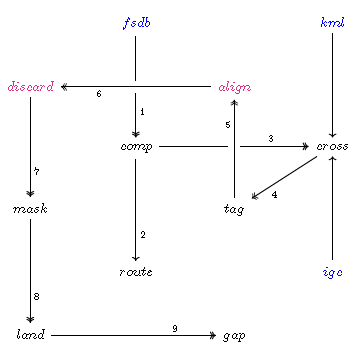

Scoring Steps
-------------

Let’s now walk through the process of scoring with ``flare-timing``, see
:numref:`score-steps`, and look at snippets of the files it writes.

.. _score-steps:

    
    Scoring as numbered steps from original inputs to ``*.csv`` or ``*.yaml`` outputs.

Starting with an ``*.fsdb`` comp and related ``*.igc`` or ``*.kml``
track logs, scoring proceeds in steps  [#]_;

#. Extract the inputs with
   `extract-input <https://github.com/BlockScope/flare-timing/tree/master/flare-timing/prod-apps/extract-input>`__.

#. Extract the outputs with
   `fs-score <https://github.com/BlockScope/flare-timing/tree/master/flare-timing/prod-apps/fs-score>`__. This step is not strictly needed for scoring but is useful for comparing the outputs of ``flare-timing`` and FS.

#. Trace the route of the shortest path to fly a task with
   `task-length <https://github.com/BlockScope/flare-timing/tree/master/flare-timing/prod-apps/task-length>`__.

#. Find pairs of fixes crossing over zones with
   `cross-zone <https://github.com/BlockScope/flare-timing/tree/master/flare-timing/prod-apps/cross-zone>`__.

#. Peg out the time range of each track log that will be scored with
   `peg-frame <https://github.com/BlockScope/flare-timing/tree/master/flare-timing/prod-apps/peg-frame>`__.

#. Interpolate between crossing fixes for the time and place where a
   track tags a zone with
   `tag-zone <https://github.com/BlockScope/flare-timing/tree/master/flare-timing/prod-apps/tag-zone>`__.

#. Index fixes from the time of first crossing with
   `align-time <https://github.com/BlockScope/flare-timing/tree/master/flare-timing/prod-apps/align-time>`__.

#. Discard fixes that get further from goal and note leading area with
   `discard-further <https://github.com/BlockScope/flare-timing/tree/master/flare-timing/prod-apps/discard-further>`__.

#. Mask a task over its tracklogs with
   `mask-track <https://github.com/BlockScope/flare-timing/tree/master/flare-timing/prod-apps/mask-track>`__.

#. Group and count land outs with
   `land-out <https://github.com/BlockScope/flare-timing/tree/master/flare-timing/prod-apps/land-out>`__.

#. Score the competition with
   `gap-point <https://github.com/BlockScope/flare-timing/tree/master/flare-timing/prod-apps/gap-point>`__.

.. [#]
   Reuse of inputs is not shown in :numref:`score-steps` as this would clutter
   the diagram too much. For instance ``*.kml`` and ``*.igc`` track logs are
   also needed as inputs for the align step.
